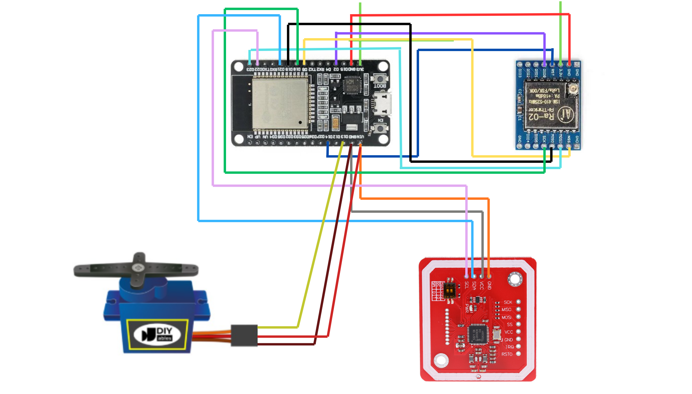
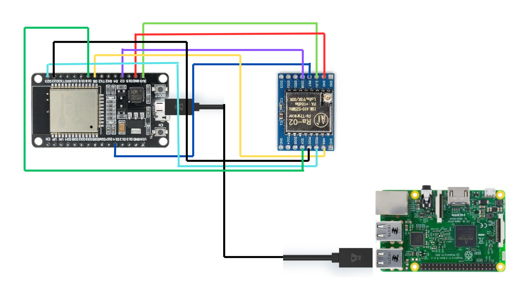
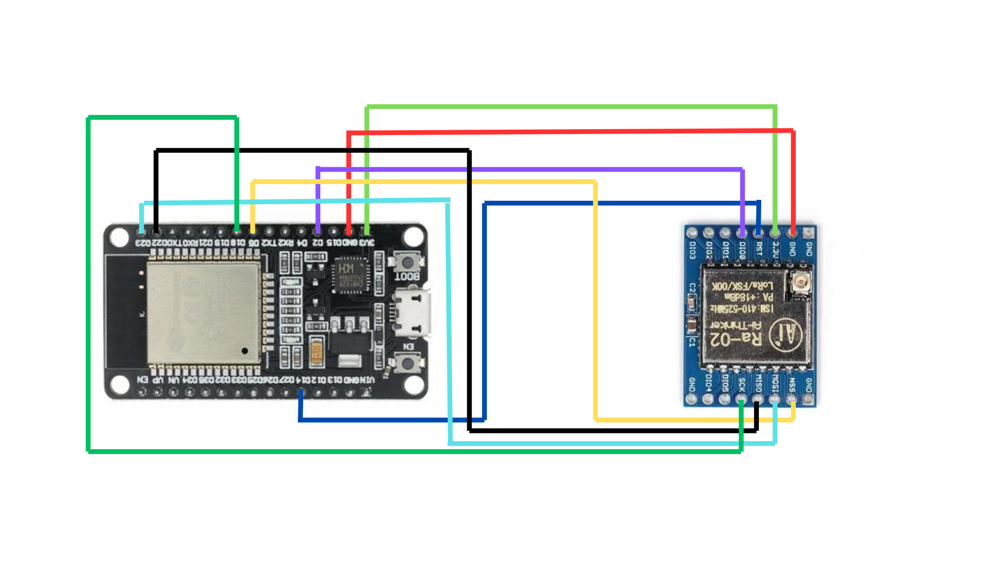
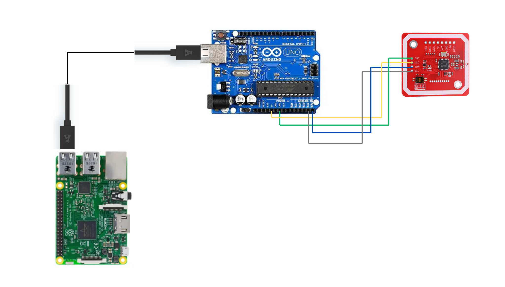

# Wiring Diagram — TheGate

## 1. Gate Node
ESP32 + LoRa Ra-02 + PN532 + Servo SG90

| ESP32 | LoRa Ra-02 | Keterangan |
|-------|-----------|------------|
| GPIO5 | NSS | SPI Chip Select |
| GPIO14 | RST | Reset |
| GPIO2 | DIO0 | Interrupt |
| GPIO18 | SCK | SPI Clock |
| GPIO19 | MISO | SPI MISO |
| GPIO23 | MOSI | SPI MOSI |
| 3.3V | 3.3V | ⚠️ bukan 5V |
| GND | GND | Ground |

| ESP32 | PN532 | Keterangan |
|-------|-------|------------|
| GPIO21 | SDA | I2C Data |
| GPIO22 | SCL | I2C Clock |
| 3.3V | VCC | Power |
| GND | GND | Ground |

| ESP32 | Servo SG90 | Keterangan |
|-------|-----------|------------|
| GPIO13 | Signal (kuning) | PWM |
| VIN | VCC (merah) | 5V |
| GND | GND (coklat) | Ground |

---

## 2. Gateway Node
ESP32 + LoRa Ra-02 → colok ke Raspberry Pi via USB

Wiring ESP32 ↔ LoRa sama dengan Gate Node.
ESP32 dihubungkan ke Raspberry Pi via **kabel USB**.

---

## 3. Relay Node
ESP32 + LoRa Ra-02 saja (tanpa PN532 dan Servo)

Wiring ESP32 ↔ LoRa sama dengan Gate Node.
Ubah `RELAY_ID` di sketch sebelum flash:
- Relay A → `#define RELAY_ID 1`
- Relay B → `#define RELAY_ID 2`

---

## 4. Registration Station (H-1)
Arduino Uno + PN532 (I2C) → colok ke Raspberry Pi via USB

| Arduino Uno | PN532 | Keterangan |
|-------------|-------|------------|
| A4 | SDA | I2C Data |
| A5 | SCL | I2C Clock |
| 3.3V | VCC | Power |
| GND | GND | Ground |
| D2 | IRQ | Interrupt |
| D3 | RST | Reset |

DIP Switch PN532: **SW1=ON, SW2=OFF** untuk mode I2C.